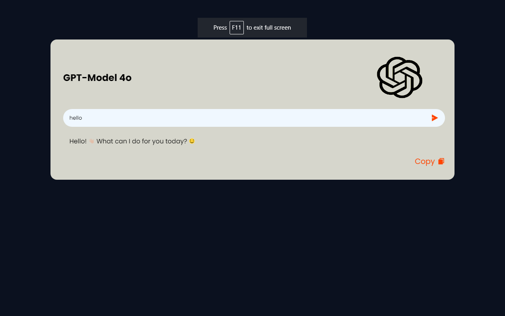

# project-gpt

<h2>>In this project, I have tried to make a chatbot that stores the messeges at localstorage and it talk to the user according to the previous responses in short. It uses GeminiAi-API and works on HTML, CSS and JS.</h2>

<a href="">View live sample!</a>

